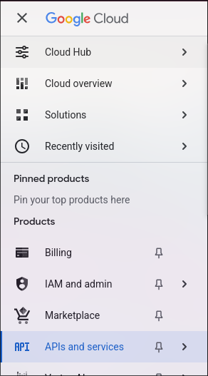
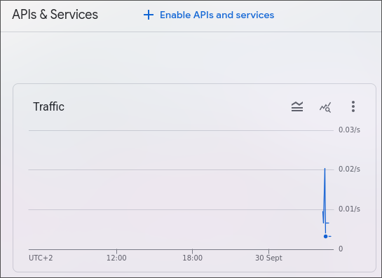
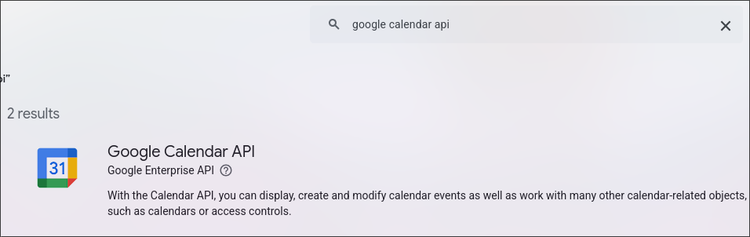
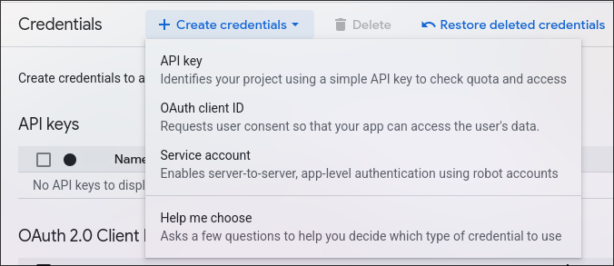
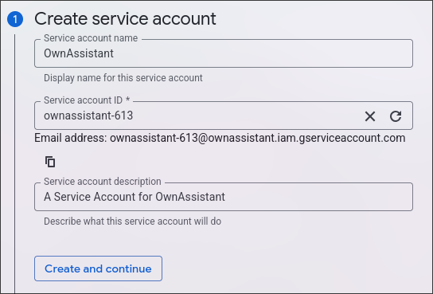
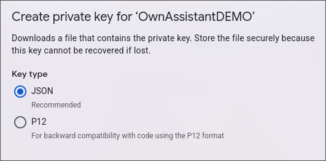
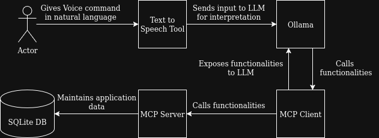

# OwnAssistant
A customizable AI Home Assistant that integrates ollama with multiple functionalities using MCP  

## Functionalities and Tools
- Get the Current Datetime: 
  - ```get_current_datetime```
- Work with Google Calendar - [Setup](#google-calendar):
  - ```create_event```
  - ```get_events```


## Getting Started

These instructions will get you a copy of the project up and running on your local machine for development and testing purposes. See deployment for notes on how to deploy the project on a live system.

### Prerequisites

What things you need to install the software and how to install them

- [node.js](https://nodejs.org/en/download/)
- [Docker](https://docs.docker.com/engine/install/) (To install and run ollama)

### Installing

#### Installing Dependencies
In the root directory run the command
```bash
npm install
```

#### Setting Environment Variables

In the root directory copy `.env.example` to `.env` and change the values. Find a list of all Environment Variables [here](#environment-variables)

#### Setting up Ollama

To initially create an Ollama Docker container run the following command
```bash
npm run ollama-init
```

To start or stop Ollama run the corresponding of the following commands:
```bash
npm run ollama-start # Start Ollama
npm run ollama-stop  # Stop Ollama 
```

#### Start the Application
To start the application run the following command
```bash
npm run start
```
>[!NOTE]
>When starting the application for the first time and when you change the used model, the startup can take several minutes, since the model has to be downloaded. 
## Running the tests

### End to End Tests

>[!NOTE] 
To be done

### Integration Tests

>[!NOTE] 
To be done

### Unit Tests
>[!NOTE] 
To be done

### Static Code Checks

>[!NOTE] 
To be done

## Deployment

>[!NOTE] 
To be done

## Functionality Setup
### Google Calendar
To connect Google Calendar, the Google Cloud is used. For this you need a Google Account with Google Calendar enabled. To get started, create a Google Cloud Project. Follow this [guide](https://developers.google.com/workspace/guides/create-project). Setting up billing is not necessary. 

In the hamburger menu on the left side of the screen select "APIs and services".

Now select "Enable APIs and services" and search for "google calendar api". Click on the corresponding entry and enable the API for Google Calendar.



Now visit [https://console.cloud.google.com/apis/credentials](https://console.cloud.google.com/apis/credentials). Click on "Create credentials" and select "Service account".

Fill the input fields and keep the created email address in mind for later.

In step 2 choose "Editor" as the assigned role for this account.
Back on the overview page [https://console.cloud.google.com/apis/credentials](https://console.cloud.google.com/apis/credentials) click on your newly created service account. Navigat to the "Keys" section and select "Add key" and "Create new key". In the popup menu select JSON as the file type and download the key file.

Move the json file to the root directory of this repo and rename it to ```google_auth.json```. You can also copy ```google_auth_example.json``` and rename it to ```google_auth.json```.

This whole process created a service google account. It can be treated as any other google account for this use case. You can now choose to either
- share your personal google calendar with the email address of this service account. This allows OwnAssistant to create and read events from this calendar.
- create a new, separate google calendar and share it with the email address of this service account. This allows OwnAssistant to only create and read events from this specific calendar and not you main calendar. All events you create in this calendar can be accessed. 
Follow this [guide](https://support.google.com/a/answer/1626902?hl=en) if you need help.

On this settings page scroll down to "Integrate calendar" and copy the calendar-id. This is used to identify the specific calendar you want to access in this application. Copy this value to the environment variable ```GOOGLE_SHARED_CALENDAR_ID``` in ```.env```.

The setup is now complete. You can now start to use the google calendar functionalities.

## Technical Details

### Built With

* [Model Context Protocol (MCP)](https://github.com/modelcontextprotocol/typescript-sdk) - The connection layer between LLM and functionalities in backend
* [Ollama JS](https://github.com/ollama/ollama-js) - The local LLM platform used

### Environment Variables

| Variable                    | Description                                                                            | Default                       |
| --------------------------- | -------------------------------------------------------------------------------------- | ----------------------------- |
| `MAX_CHAT_ITERATIONS`       | Maximum Number of Iterations and Tool Calls the LLM is allowed to take                 | `6`                           |
| `MODEL`                     | Model used to orchestrate tools. See [List of Recommended Models](#recommended-models) | `llama3.2:3b-instruct-q4_K_M` |
| `GOOGLE_SHARED_CALENDAR_ID` | Google Calendar ID to identify the google calendar used with this application          | none                          |

### Recommended Models
#### Small
- qwen2.5:3b-instruct-q4_K_M
- llama3.2:3b-instruct-q4_K_M

### Planned Architecture



### DB Schema

>[!NOTE] 
To be done

## Contributing

Since the project is its very early stages, I am not open to contributions at the moment. But thank you none the less for your interest :)
## Versioning

>[!NOTE] 
To be done
## Authors
 - [**EinfachNiklas**](https://github.com/EinfachNiklas) - *Initial work*

## License

This program is free software: you can redistribute it and/or modify
it under the terms of the GNU General Public License version 3 only,
as published by the Free Software Foundation.
See the [LICENSE](https://github.com/EinfachNiklas/CrowdMap/blob/main/LICENSE) file for details

## Acknowledgments

* Thanks to [PurpleBooth](github.com/PurpleBooth) for the ```README.md``` template