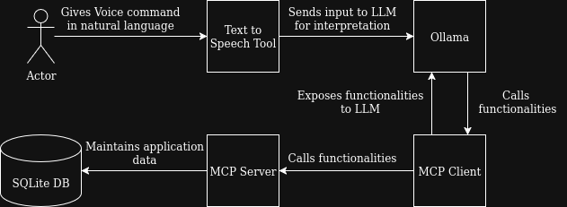

# OwnAssistant
A customizable AI Home Assistant that integrates ollama with multiple functionalities using MCP  

## List of Functionalities
- Get the Current Datetime via Tools: 
  - ```get_current_datetime```
- Work with [Google Calendar](https://developers.google.com/workspace/calendar/api/quickstart/nodejs)


## Getting Started

These instructions will get you a copy of the project up and running on your local machine for development and testing purposes. See deployment for notes on how to deploy the project on a live system.

### Prerequisites

What things you need to install the software and how to install them

- [node.js](https://nodejs.org/en/download/)
- [Docker](https://docs.docker.com/engine/install/) (To install and run ollama)

### Installing

#### Installing Dependencies
In the root directory run the command
```bash
npm install
```

#### Setting Environment Variables

In the root directory copy `.env.example` to `.env` and change the values. Find a list of all Environment Variables [here](#environment-variables)

#### Setting up Ollama

To initially create an Ollama Docker container run the following command
```bash
npm run ollama-init
```

To start or stop Ollama run the corresponding of the following commands:
```bash
npm run ollama-start # Start Ollama
npm run ollama-stop  # Stop Ollama 
```

#### Start the Application
To start the application run the following command
```bash
npm run start
```
>[!NOTE]
>When starting the application for the first time and when you change the used model, the startup can take several minutes, since the model has to be downloaded. 
## Running the tests

### End to End Tests

>[!NOTE] 
To be done

### Integration Tests

>[!NOTE] 
To be done

### Unit Tests
>[!NOTE] 
To be done

### Static Code Checks

>[!NOTE] 
To be done

## Deployment

>[!NOTE] 
To be done

## Technical Details

### Built With

* [Model Context Protocol (MCP)](https://github.com/modelcontextprotocol/typescript-sdk) - The connection layer between LLM and functionalities in backend
* [Ollama JS](https://github.com/ollama/ollama-js) - The local LLM platform used

### Environment Variables

| Variable              | Description                                                                            | Default                       |
| --------------------- | -------------------------------------------------------------------------------------- | ----------------------------- |
| `MAX_CHAT_ITERATIONS` | Maximum Number of Iterations and Tool Calls the LLM is allowed to take                 | `6`                           |
| `MODEL`               | Model used to orchestrate tools. See [List of Recommended Models](#recommended-models) | `llama3.2:3b-instruct-q4_K_M` |

### Recommended Models
#### Small
- qwen2.5:3b-instruct-q4_K_M
- llama3.2:3b-instruct-q4_K_M

### Planned Architecture



### DB Schema

>[!NOTE] 
To be done

## Contributing

Since the project is its very early stages, I am not open to contributions at the moment. But thank you none the less for your interest :)
## Versioning

>[!NOTE] 
To be done
## Authors
 - [**EinfachNiklas**](https://github.com/EinfachNiklas) - *Initial work*

## License

This program is free software: you can redistribute it and/or modify
it under the terms of the GNU General Public License version 3 only,
as published by the Free Software Foundation.
See the [LICENSE](https://github.com/EinfachNiklas/CrowdMap/blob/main/LICENSE) file for details

## Acknowledgments

* Thanks to [PurpleBooth](github.com/PurpleBooth) for the ```README.md``` template